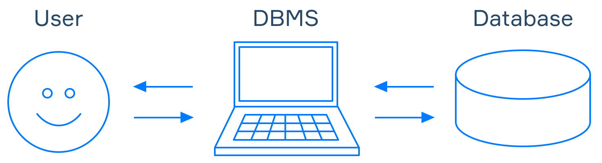
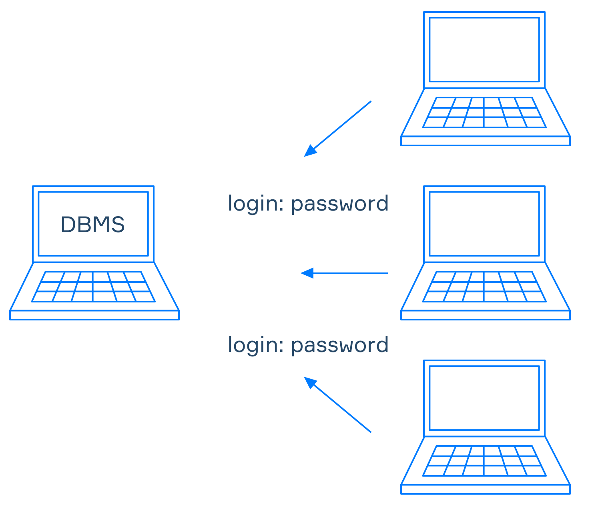

[TOC]

# 数据库

**数据库** 是专门为计算机处理的快速搜索和检索而组织的数据集合

通常，数据库中的信息被压缩并存储为二进制而不是纯文本，因此很明显这种结构是为计算机而不是人类设计的。

计算机可以很容易地理解数据的二进制格式，但是是什么让它们能够正确地读写呢？ 它是一个称为 **数据库管理系统** ，用于控制数据库中的数据。 

# 数据库管理系统 DBMS

数据库管理系统 ( **DBMS** ) 是一种允许用户定义、创建和控制数据的软件。 

DBMS 可以优化查询并以最佳方式从数据库中检索数据。  它是用户和数据库之间的中介，这意味着用户可以通过 DBMS 的接口使用它。  此外，它还可以帮助将数据与用户隔离。 

他们共用一套SQL标准，因此可以在不同的DBMS中应用相同的命令。

# 访问数据

数据库提供**模式schemas**和**元metadata**允许快速搜索所需数据。

```
A schema describes how you organize the data. Metadata holds structural and statistical information.

架构描述了您如何组织数据。 元数据包含结构和统计信息。 
```

为了向其他人提供受限访问，一些管理系统使用简单的登录/密码验证，而一些提供更强大的工具。  在他们的帮助下，您可以授予每个用户访问有限数据的权限。 



# 数据一致性

数据库的最佳特性之一是它们能够正确保存和恢复数据。

如果几个人同时访问相同的数据，则可能会出现问题。   文件中的更新通常遵循“最后保存获胜”规则，这会导致更新冲突。   例如，如果有人决定为您的待办事项列表做出贡献，那么遵循“保存的最后更改”文件更新规则，您可能会丢失刚刚创建的通知并错过您安排在明晚的足球比赛。  同时，**数据库隔离了不同的用户，并且可以通过配置来解决他们更新之间的冲突**。

# 小结

使用数据库，您可以： 

- 存储、检索和更新数据； 
- 获取元数据； 
- 远程访问数据库； 
- 限制对数据的访问； 
- 进行并发更新； 
- 恢复到某个时间点； 
- 自动检查数据一致性规则。 