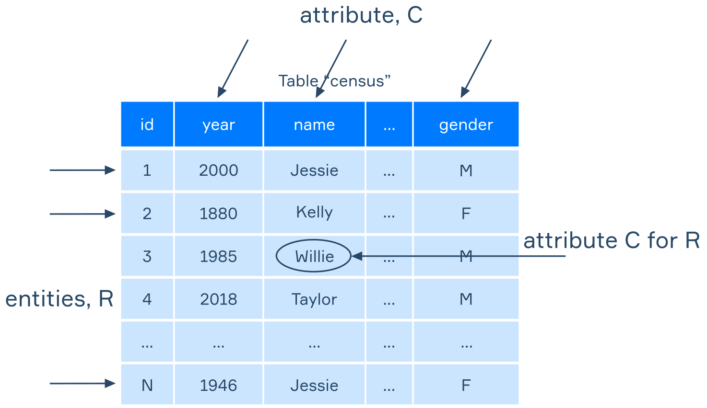

# 简介

**SQL（结构化查询语言）** 是一种 [特定于领域的编程语言 ](https://www.jetbrains.com/mps/concepts/domain-specific-languages/)，旨在处理表中的数据。 它是在 1970 年代开发的。 时至今日，类 SQL 接口在各种数据管理系统中非常流行，而不仅仅是基于表`table`的系统！ 

下面这几句SQLite的含义是：

```bush
It selects records about individuals named 'Jessie' who were born BETWEEN 1920 and 2000. It groups them by year and gender, counts the number of records in each group via COUNT(*), and generates a table with columns named year, gender, and cnt. It also sorts the table by year and gender in descending(下降) order.
```

即查找名字为`Jessie`，出生在1920-2000,的个体，将他们分组为`year`和`gender`，计算每组的记录数量，生成一个表其中的列名为 `year`,  `gender`， 和 `cnt`.  它还对表格进行排序 `year`和 `gender`按降序排列。 

```sqlite
SELECT
  year, gender, COUNT(*) as cnt
FROM
  census
WHERE
  year BETWEEN 1920 and 2000
  AND name = 'Jessie'
GROUP BY
  year, gender
ORDER BY
  year, gender DESC
```

# S 代表结构化 Structured

SQL 是一种用于提取和更新 **结构** 为表的数据的语言。类数据出现在各种应用领域，例如包含会计数据的 Excel 电子表格，或 Google BigQuery 中的人口普查统计数据。 另一个示例是利用特殊软件系统存储和访问表的在线商店，称为 **关系数据库管理系统 (RDBMS)** 。 这些可以帮助处理有关商品、订单和客户的信息。 

SQL 旨在用于具有特定结构的表：

这些表包含  **行** 和 **列** 。 每一行都是具有一组属性或属性的对象或实体。 例如，第三行包含有关 1985 年出生的男子 Willie 的数据。 

数据通常被组织成一组表，称为 **数据库** 。 然后可以使用它们各自的名称访问这些表。 例如，在一个在线商店的数据库中，一个名为 `Customers`可能包含有关公司客户的一般信息：他们的姓名和联系方式。  这 `Orders`表将存储有关他们下的特定订单的信息：客户姓名、商品、付款细节。 

# Q 代表查询 Query

SQL 是一种具有大量数据处理功能的编程语言。 它是 **声明性** 的，这意味着用 SQL 编写的语句是一个 **查询** ，它告诉系统应该做什么或评估什么，但没有指定如何做。 

在下一个示例中，查询从表中提取所有行和列 `Census`: 

```sqlite
SELECT * FROM Census;
```

象征 `*`用于从表中选择所有内容。(类似Java导入所有类)

每个 SQL 语句都必须以分号`;`结束，也称为 **语句终止符** 。 否则，将出现错误。 仅当您一次进行一个查询时才可以省略分号，但最好始终将分号放在查询的末尾。 

关键字如 `SELECT`在 SQL 语言中不区分大小写。  它们可以是任何字母大小写，但通**常全部大写**以使它们更明显。 

# L 代表语言 Language

用SQL,总是需要人类看的懂才行吧！L代表人类语言!