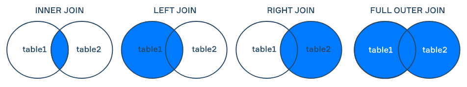
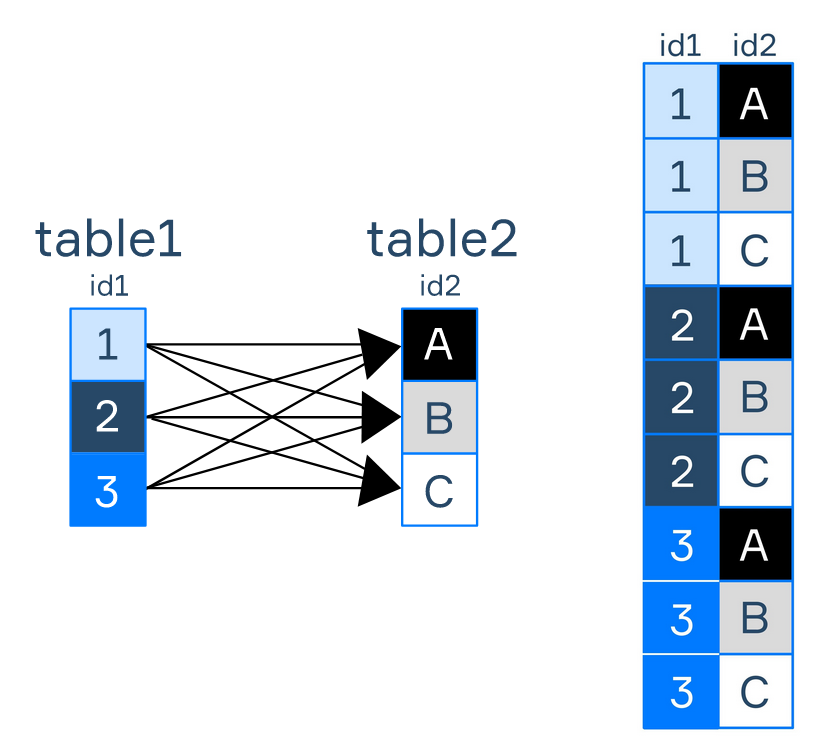

> 信息往往存储在多个表中. 为了使用多个表来获取所需信息, JOIN的作用就是**依据所所条件来组合来自两个表的记录.  当搜索条件为真的时候, 记录被连接.

# JOIN的类型

SQL中不同的JOIN:

- **[INNER] JOIN** ：对于左表中的每条记录，右表中满足合并条件的所有记录将与原始记录合并并添加到结果表中。 如果在右表中没有找到匹配的记录，则原始记录也不会添加到结果表中（使用关键字 `INNER`是可选的）。 
- **LEFT/RIGHT JOIN** ：返回左/右表中的所有记录以及右/左表中的匹配值。 如果其中一张表（例如左侧）中的某些记录在另一张（例如右侧）表中没有匹配项，则该右侧表的输出中的相应列将被分配 **NULLs** 。 
- **FULL [OUTER] JOIN：** 当左表或右表中存在匹配时返回所有记录。 没有匹配的记录被分配 **NULL** （使用关键字 `OUTER`是可选的）。 



- **CROSS JOIN** ：连接左表中的每条记录和右表中的每条记录（算法如下图所示）。 请注意，我们没有指定连接两个表的条件。 



因此，table1 中的 id1 与 idA、idB 和 idC 连接，id2 也与 idA、idB 和 idC 连接，id3 也是如此。 

# INNER JOIN

两个表中存在某数据相连接的关系, 比如

两个表table1, table2 他们的某个属性相联系 ,形如id,两个表完全就是一样的数据.INNER JOIN 的常用语法如下： 

```sql
SELECT table1.col_name1, table2.col_name2
FROM table1 [AS a]
INNER JOIN table2 [AS b]
    ON table1.id = table2.id;
```

> 有时候连接条件可以不是等式

# INNER JOIN的排序结果

前提数据:

pets:

| **character_id** | **pet_species**   |
| ---------------- | ----------------- |
| 1                | owl               |
| 3                | snake             |
| 4                | cat               |
| 6                | dragon "Drogo"    |
| 6                | dragon "Rhaegal"  |
| 6                | dragon "Viserion" |
| 8                | puppy             |
| 9                | unicorn           |

owner's name:

| **character_id** | **character_name** | **universe_id** |
| ---------------- | ------------------ | --------------- |
| 1                | Harry Potter       | 1               |
| 2                | Severus Snape      | 1               |
| 3                | Voldemort          | 1               |
| 4                | Hermione Granger   | 1               |
| 5                | Tyrion Lannister   | 2               |
| 6                | Daenerys Targaryen | 2               |
| 7                | Argus Filch        | 1               |


回到我们的实际例子，假设你想知道什么宠物属于什么角色。  为此，我们需要执行以下查询： 

```sql
SELECT character_name, pet_species 
FROM character 
INNER JOIN pet
    ON character.character_id = pet.character_id
ORDER BY character.character_name;
```

| **character_name** | **pet_species**   |
| ------------------ | ----------------- |
| Daenerys Targaryen | dragon "Drogo"    |
| Daenerys Targaryen | dragon "Rhaegal"  |
| Daenerys Targaryen | dragon "Viserion" |
| Harry Potter       | owl               |
| Hermione Granger   | cat               |
| Voldemort          | snake             |

由此发现,并不会显示出所有角色, 因为宠物的id和角色对不上. 为了让所有角色出现,就可以使用LEFT JOIN, 这样没对上号的角色的宠物栏就会显示NULL

```sql
SELECT character_name, pet_species 
FROM character 
LEFT JOIN pet
    ON character.character_id = pet.character_id
ORDER BY character.character_name;
```

结果:

| **character_name** | **pet_species**   |
| ------------------ | ----------------- |
| Argus Filch        | NULL              |
| Daenerys Targaryen | dragon "Drogo"    |
| Daenerys Targaryen | dragon "Rhaegal"  |
| Daenerys Targaryen | dragon "Viserion" |
| Harry Potter       | owl               |
| Hermione Granger   | cat               |
| Severus Snape      | NULL              |
| Tyrion Lannister   | NULL              |
| Voldemort          | snake             |

# 小结

要连接多个表，请遵循以下通用模板： 

```sql
SELECT val1 [AS name1], ..., valN [AS nameN]
FROM table1 
[type_of_join] JOIN  table2 
    ON table1.col_name_table1 = table2.col_name_table2
[type_of_join] JOIN table3
    ON table2.col_name_table2 = table3.col_name_table3;
```

顺序不能乱,先连接2,再连接3