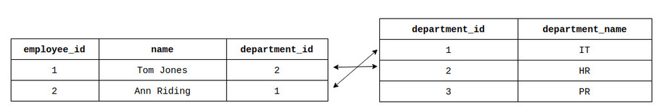

> 下面会出现Mysql方言.
>
> 一张是员工表，一张是部门表。  在这里，我们面临另一个挑战：如何连接这些表中的数据？  如果我们添加一个部门名称不存在的员工，如何避免出现问题？

[TOC]

# 外键约束

假设我们已经有一个表 *部门* ，其列 *department_id* INT PRIMARY KEY 和 *department_name* VARCHAR(20) NOT NULL。 它看起来如下： 

| department_id | department_name |
| ------------- | --------------- |
| 1             | IT              |
| 2             | HR              |
| 3             | PR              |

我们要创建一个表 *employees* ，其中包含 *employee_id* INT PRIMARY KEY、 *name* VARCHAR(60) 和 *department_id* INT 列。

很明显,双方的*department_id* 是相互连接的,两个表也因此连接起来

我们可以将 *department_id* 中 *employees* 为 **外键** 或  **引用键** 。 数据库管理系统会为我们控制可以存储在外键表 *employees* 。 

**注意!**

**FOREIGN KEY 约束只能引用同一数据库中的表**

我们可以使用 **FOREIGN KEY 约束** 并创建表 *employees* 。 主键和外键的数据类型必须相同.外键指向的表称为引用或者父表,示例:

```sql
CREATE TABLE employees (
    employee_id INT PRIMARY KEY,
    name VARCHAR(60) NOT NULL, 
    department_id INT,
    CONSTRAINT fk_department FOREIGN KEY (department_id)
    REFERENCES departments(department_id)
); 
```

fk_department代表 *employees*表的外键,fk_department对应着*employees*表的department_id, 这个外键引用着*departments*表的department_id

执行查询之后, *employees*成为了**子表,即包含外键的表**

之后向*employees*插入(1, 'Ann Riding', 4)会出现错误,外键;连接着的department_id不存在4

## 匿名外键

```sql
CREATE TABLE employees (
    employee_id int PRIMARY KEY,
    name VARCHAR(60) NOT NULL,
    department_id INT,
    FOREIGN KEY (department_id) REFERENCES departments(department_id)
);
```

但是不推荐,可能因为SQL方言不同存在差异

# Referential actions 引用操作

假设我们在表 *employees中添加了一些数据，* 现在  我们的表 *department* 和 *employees* 是这样的： 



在表中,为了防止主键和外键的表发生变动,导致数据紊乱,规定了有两种方法限制:

**ON DELETE** 和 **ON UPDATE** ,分别对应着删除数据和更新数据

那么这两种情景下面, 有以下操作分类

- **CASCADE**: 如果父表中的行被删除或者更新,**子表对应的行自动删除或者更新**
- **SET NULL**: 如果父表中的行被删除或者更新,**子表中对应的外键值全部会被设置成NULL**
- **RESTRICT**:如果父表中想进行删除或者更新,**直接不允许!**
- **SET DEFAULT**:如果父表中的行被删除或者更新,**子表外键值会自动设置为给定的默认值**
- **NO ACTION**:取决于方言,**Mysql中和RESTRICT相同**

示例

```sql
CREATE TABLE employees (
    employee_id int PRIMARY KEY,
    name VARCHAR(60) NOT NULL, 
    department_id INT,
    CONSTRAINT fk_department FOREIGN KEY (department_id)
    REFERENCES departments(department_id)
    ON DELETE SET NULL
    ON UPDATE CASCADE
); 
```

# 给已有的表添加外键

使用 **ALTER TABLE ADD FOREIGN KEY** 语句

```sql
ALTER TABLE employees
ADD FOREIGN KEY (department_id) REFERENCES departments(department_id);
```

约束多个列请使用 **ALTER TABLE ADD CONSTRAINT** 语句： 

```sql
ALTER TABLE employees
ADD CONSTRAINT fk_department FOREIGN KEY (department_id)
REFERENCES departments(department_id);
```

# 删除外键

请使用 **ALTER TABLE DROP FOREIGN KEY** 语句： 

```sql
ALTER TABLE employees 
DROP FOREIGN KEY fk_department;
```

**注意!**

必须知道外键的名称才能删除它,所以设置外键的时候最好取名字

如果你是匿名外键,使用如下语句获取外键名称

```sql
SHOW CREATE TABLE table_name; 
```