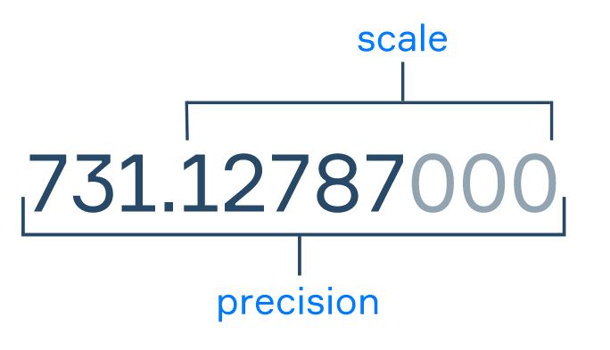

在一个表中，通常，来自表中同一列的数据值具有相同的含义和类型。每一个格子中的数据类型存在差异

| manufacture_year | color | horsepower | price  | electricity | ...  |
| ---------------- | ----- | ---------- | ------ | ----------- | ---- |
| 2018             | red   | 283        | 34.990 | TRUE        | ...  |
| 2019             | black | 313        | 50.000 | FALSE       | ...  |
| ...              | ...   | ...        | ...    | ...         | ...  |

我们在 `manufacture year`列是整数，值在 `price`是十进制的，值在 `electricity`是布尔值。 SQL 数据库通常要求数据库表中的每一列都有名称和 **数据类型** 。 专栏 `data type`限制可以存储在列中的一组值，并定义一组可能的操作。 

我们将考虑一个非常基本的数据类型子集： `INTEGER`,  `FLOAT`,  `DECIMAL`,  `VARCHAR`， 和 `BOOLEAN`. 

# 数值数据类型 Numberical data types

## INTEGER

`INTEGER` 是一种数字数据类型，表示一定范围的数学整数（通常从 -2147483648 到 +2147483647）。 `INTEGER`type 适用于计数器、数字标识符以及您可以想象的适合比例范围的任何整数业务值。 

## DECIMAL

在日常生活中，我们通常会遇到很多十进制数字：例如，在测量体温（36.6 摄氏度）或计算我们宝贵的财务（ 103050.79 美元）时。 SQL 支持此类值的特殊数据类型 – `DECIMAL(precision, scale)`. 

这种类型有两个参数：精度和比例。 

- **比例**  是小数点右侧的位数。 
- **精度**  是数字中的总位数。 



顺便说一句，有时在 SQL 中，你会遇到 `REAL` 数据类型。  所以 `REAL`是 `FLOAT(24)`， 或者 `FLOAT`具有一定的准确性。 

# 文本数据类型 Text

当然，人们可能想要处理的不是数字数据，而 SQL 支持一系列旨在表示文本数据的数据类型。  让我们考虑其中一个，非常普遍和基本 - `VARCHAR(n)`. 

这种类型表示不超过长度`n`的字符串。

例如，可以插入字符串 `apple`,  `plum`， 和 `peach`进入具有类型的列 `VARCHAR(5)`.  字符串 `orange`和 `banana`将超过长度限制，如果尝试插入如此长的值，系统将截断它们或生成错误。 

# 布尔值 Boolean

这 `BOOLEAN`type 表示布尔逻辑值：要么 `TRUE`或者 `FALSE`.  这种简单的数据类型可用于任何具有标志语义的属性，例如，客户是否访问过竞争对手的网站。 

# 如何创建并使用数据类型

让我们考虑一个定义表的 SQL 查询示例 `census`有五列： `id`类型 `INTEGER`,  `name`类型 `VARCHAR(20)`,  `birth_place_latitude`类型 `REAL`,  `year_income`类型 `DECIMAL(20,3)`， 和 `is_parent`类型 `BOOLEAN`. 

```sql
CREATE TABLE census (
    id INTEGER,
    name VARCHAR(20),
    birth_place_latitude REAL,
    year_income DECIMAL(20,3),
    is_parent BOOLEAN
);
```

模板可以认为是：

```sql
CREATE TABLE table_name (
    column_name_1 column_type_1,
    ..., 
    column_name_n column_type_n
);
```