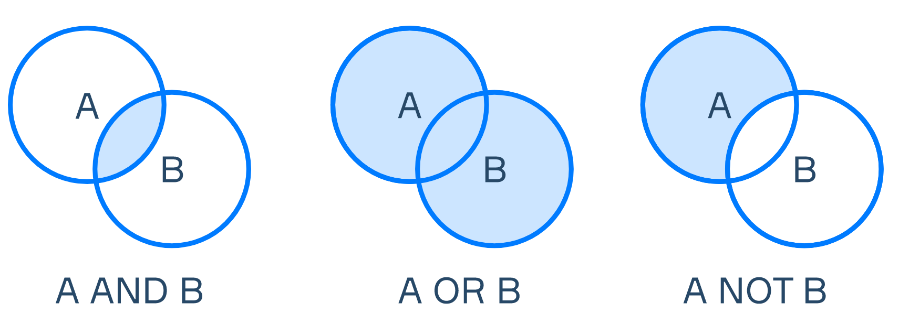

有时候获取信息，我可以给定一个区间来限定数据的范围，那么就需要**过滤**

假设您负责一个书店数据库。 您已经知道如何从表“书籍”中选择有关所有实体的预处理信息。 每个选择中有很多行，您需要根据某些条件过滤它们，例如按作者、语言、某些属性甚至客户端请求的表达式。 从表中选择行的子集称为 **过滤** 。 

# 按条件过滤

在大多数情况下，当我们进行查询时，我们只想提取那些符合特定标准的记录。  为了过滤选择，有一个特殊的运算符 `WHERE`在 SQL 中。 

该运算符的语法如下： 

```sql
SELECT *
FROM table
WHERE conditions
```

在里面 `conditions`我们可以在字段中插入我们希望提取的数据与之一致的任何参数。  但是，为了定义那些特定的选择条件，我们需要将它们应用于表达式。 

假设您的第一个客户想要购买查尔斯狄更斯的书。  让我们编写一个查询来选择符合条件的书籍： 

```sql
SELECT id, title, rating
FROM books
WHERE author = 'Charles Dickens';
```

在结束时 `SELECT`声明，我们添加了一个关键字  `WHERE`后跟指定过滤器的逻辑表达式 `author = 'Charles Dickens'`.  

这 `SELECT`子句不必包含列中列出的列或表达式 `WHERE`条款。  例如，我们不必输出 `author`在上面的查询中，即使有相应的条件 `WHERE`. 

# 比较过滤

| =      | equality check                  |
| ------ | ------------------------------- |
| <, >   | less, greater                   |
| <=, >= | less or equal, greater or equal |
| <>, != | not equal                       |

通常，我们将比较应用于数值。  如果我们想通过字符串文字或日期进行选择，我们应该将它们放在引号中 ( `" "`). 

以下是从表中提取数据的一些示例  `products`使用比较。 

| **product_id** | **product_name** | **price** | **category** |
| -------------- | ---------------- | --------- | ------------ |
| 1              | Milk             | 70        | dairy        |
| 2              | Cheese           | 500       | dairy        |
| 3              | Chicken          | 250       | meat         |
| 4              | Pork             | 350       | meat         |
| 5              | Potato           | 40        | vegetables   |
| 6              | Tomato           | 150       | vegetables   |

查询价格超过`250`商品

```sql
SELECT *
FROM products
WHERE price > 250
```

查询结果：

| **product_id** | **product_name** | **price** | **category** |
| -------------- | ---------------- | --------- | ------------ |
| 2              | Cheese           | 500       | dairy        |
| 4              | Pork             | 350       | meat         |

查询是否是蔬菜：**不能忘记`""`，这至关重要！

```sql
SELECT *
FROM products
WHERE category = 'vegetables'
```

结果：

| **product_id** | **product_name** | **price** | **category** |
| -------------- | ---------------- | --------- | ------------ |
| 5              | Potato           | 40        | vegetables   |
| 6              | Tomato           | 150       | vegetables   |

# 逻辑表达式

先学习三个关键字 ：`NOT`、`AND`、`OR`.

- `NOT` returns `True` if argument equals to `False` and vice versa.

- `AND` compares operands and returns `True` only if all of them are `True`. Alternatively, returns `False`***.***

- `OR` returns `True` if at least one of the operands is `True`. Otherwise, returns `False`.

用图来表示就是：



下面我们有一个名为 `staff`包含在我们公司工作的程序员的信息。  想象一下，我们想要选择适合我们下一个项目的那些。 

为了为该项目聘请合适的人选，我们需要一个候选人满足两个要求：成为中级或高级并了解 SQL。

| **person_id** | **name** | **status** | **skills** | **KPI** |
| ------------- | -------- | ---------- | ---------- | ------- |
| 1             | Mike     | Middle     | SQL        | 80      |
| 2             | Sara     | Senior     | SQL        | 90      |
| 3             | Chan     | Middle     | Python     | 70      |
| 4             | Mohit    | Junior     | Java       | 60      |
| 5             | Alisha   | Junior     | SQL        | 50      |
| 6             | Ivan     | Middle     | SQL        | 70      |

我们的查询应该如下所示： 

```sql
SELECT *
FROM staff
WHERE (status="Middle" OR status="Senior") AND skills="SQL"
```

我们可以使用 `NOT`操作数而不是 `OR`: 

```sql
SELECT *
FROM staff
WHERE NOT(status="Junior") AND skills="SQL"
```

结果：

| **person_id** | **name** | **status** | **skills** | **KPI** |
| ------------- | -------- | ---------- | ---------- | ------- |
| 1             | Mike     | Middle     | SQL        | 80      |
| 2             | Sara     | Senior     | SQL        | 90      |
| 6             | Ivan     | Middle     | SQL        | 70      |

## 补充 IN

表示在这之中，例如查询客户是这些国家的操作。

```sql
SELECT * FROM Customers
WHERE Country IN ('Germany', 'France', 'UK');
```

